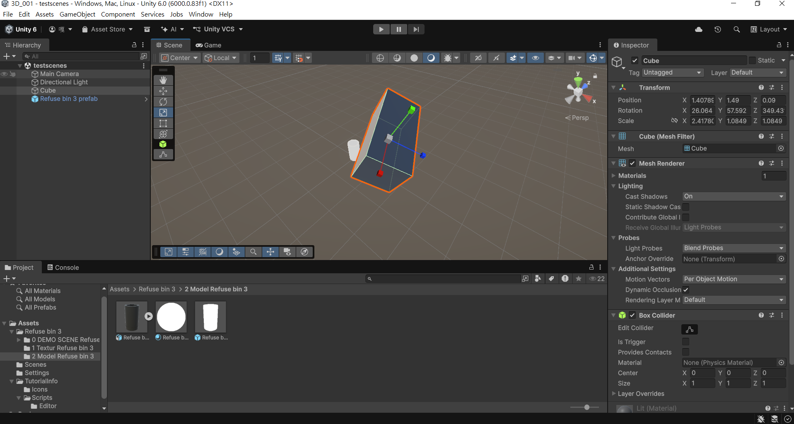

# 1151VR-HW1-414262466-ychj

輔仁大學 資工系｜Unity 3D 虛擬實境應用｜作業一

Unity 6000.0.83f1（Universal 3D 範本）

## 專案截圖

## 連結

- GitHub：https://github.com/z9487xd/1151VR-HW1-414262466-ychj
- YouTube：https://youtu.be/5gn3d6gBe-8

## 影片章節

| 時間 | 內容 |
|---|---|
| 0:14 | 新增立方體 |
| 0:18 | 匯入 3D 模型 |
| 0:20 | Scene 視角調整 |
| 0:37 | 改變物件形狀 |
| 1:00 | 執行遊戲 |
| 1:10 | 儲存場景、另存新檔 |

